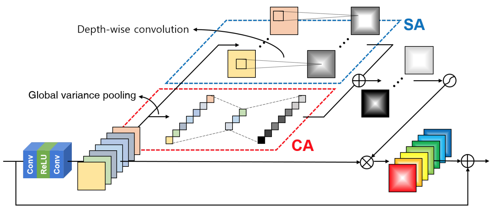
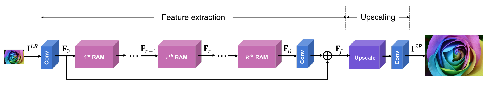
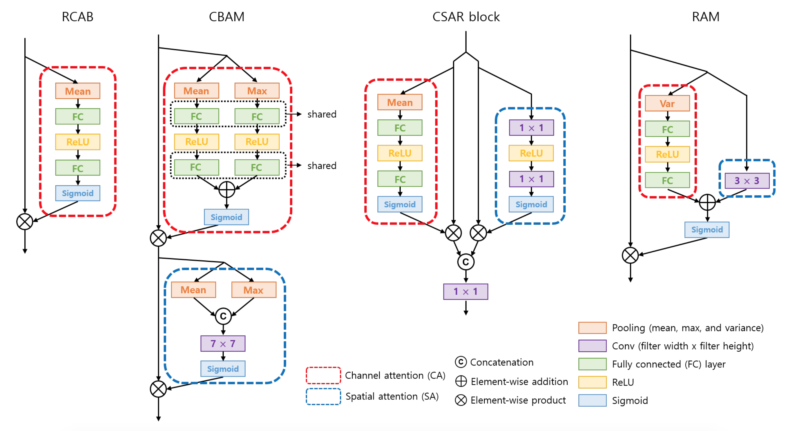
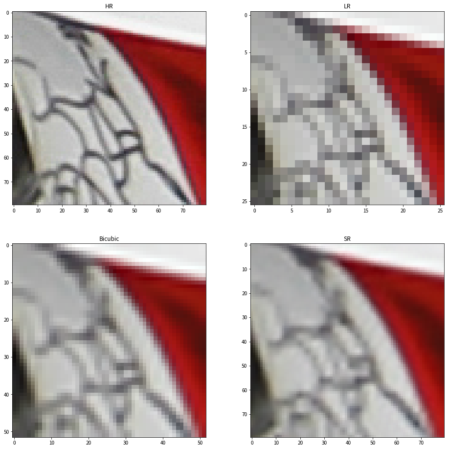

# SRRAM with tf.keras
## Inttoduction
This is an unofficial implementation of RAM: Residual Attention Module for Single Image Super-Resolution [[arXiv]](https://arxiv.org/abs/1811.12043). 

RAM is one of attention blocks for super-resolution that has channel-attention(CA) and spatial-attention(SA). CA is computed using global variance pooling and fully-connected layers, and SA is obtained by depth-wise covolutions. After the parallel computation, they are fused by element-wise addition and activated by softmax operator, finally applied into the original feature maps. Before the output, there is a skip-connection from the previous layer.



SRRAM consists of stacked RAMs like EDSR.



The attention blocks having CA and SA have already proposed, however, their attentions are applied sequentially or directly to input features, which means that the attentions is appied 2 times for each block. RAM is clearly different from other blocks because of the fusion before the application.




## Requirements
- tensorflow 1.10+
- numpy
- scipy
- googledrivedownloader
- requests

## Downloading Data
In this repo, you can use General-100 dataset by the following commands. 
```
root $ cd ./data
data $ python General-100.py
```
Downloaded data will be randomly splitted into `train:test:val = 8:1:1`. If you want to use any other datasets or split strategies, please change the codes.

## Training
You can train the network like below.
```
python train.py 
```
You can set the hyper-parameters therough the arguments. Please check them out by setting `--help`.  
The default parameters is not optimized now, so I will update them.

## Testing on your image
After your training, you can test the model on your image like below.
```
python test.py --model_dir path/to/your/.h5 --filename path/to/your/image
```

## Results
This is a x3 result with only 2200 epoch training. If you have more  data or training time, the results will be improved. ;-)


## Citation
```
Jun-Hyuk Kim, Jun-Ho Choi, Manri Cheon and Jong-Seok Lee,"RAM: Residual Attention Module for Single Image Super-Resolution", arXiv preprint arXiv:1811.12043, 2018 
```